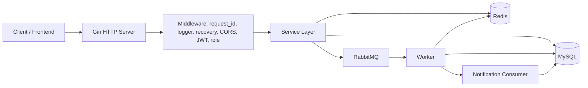
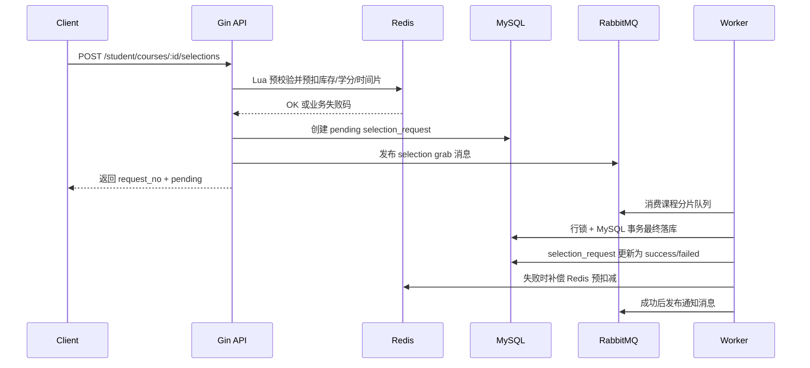

# ChooseCourse

ChooseCourse 是一个课程选择后端系统，主体代码位于 `Backend/`。项目以 Go + Gin 提供 HTTP API，以 MySQL 保存业务数据，以 Redis 承担高并发选课预校验和缓存，以 RabbitMQ 拆分异步抢课、通知落库等后台任务。

当前仓库主要覆盖后端能力：学生和管理员登录、课程管理、学生管理、课程搜索、点赞评论、异步抢课、退课、课表查询、消息中心、健康检查和 k6 压测脚本。

## 功能概览

- 双角色登录鉴权：学生和管理员分别登录，统一签发 JWT。
- 管理端：维护管理员资料、学生资料、课程信息。
- 学生端：查看和修改个人资料，查询课程，点赞课程，评论课程。
- 选课链路：Redis Lua 原子预校验和预扣减，RabbitMQ 异步投递，worker 最终 MySQL 事务落库。
- 退课链路：MySQL 事务同步完成退课、学分回退、课程人数回退，并刷新 Redis 缓存。
- 请求状态：抢课请求写入 `selection_requests`，前端可通过 `request_no` 轮询最终状态。
- 通知中心：抢课、退课、点赞、评论等成功后发布通知消息，由 worker 异步写入 `notifications`。
- 健康检查：`/health` 同时检查 MySQL、Redis、RabbitMQ。
- 压测支持：内置 k6 脚本和批量学生 SQL，可验证高并发抢课不超卖。

## 技术栈

| 类别 | 技术 |
| --- | --- |
| 语言 | Go 1.25 |
| Web 框架 | Gin |
| ORM | Gorm |
| 配置 | Viper + YAML + 环境变量覆盖 |
| 日志 | Zap |
| 鉴权 | JWT |
| 数据库 | MySQL 8.4 |
| 缓存 | Redis 7.2 |
| 消息队列 | RabbitMQ 3.13 management |
| 容器 | Docker / Docker Compose |
| 压测 | k6 |

## 架构说明



项目有 3 个可执行入口：

| 入口 | 路径 | 作用 |
| --- | --- | --- |
| HTTP 服务 | `Backend/cmd/server` | 启动 Gin API，初始化 MySQL、Redis、RabbitMQ，启动时预热选课缓存 |
| 后台 worker | `Backend/cmd/worker` | 消费抢课分片队列、通知队列，扫描超时 pending 请求 |
| 数据迁移 | `Backend/cmd/migrate` | 使用 Gorm AutoMigrate 建表，可通过 `-seed` 写入演示数据 |

## 目录结构

```text
.
├── LICENSE
├── README.md
└── Backend
    ├── cmd
    │   ├── migrate          # 建表和种子数据入口
    │   ├── server           # HTTP API 入口
    │   └── worker           # RabbitMQ 消费者和后台任务入口
    ├── configs              # 配置文件模板和本地配置
    ├── docs                 # 项目补充文档，例如压测总结
    ├── internal
    │   ├── cache            # Redis key、Lua 脚本、缓存预热和重建保护
    │   ├── config           # Viper 配置加载
    │   ├── handler          # Gin handler
    │   ├── middleware       # 鉴权、角色、日志、恢复、跨域、Request ID
    │   ├── model            # Gorm 数据模型
    │   ├── mq               # RabbitMQ 连接、拓扑、生产者、消费者
    │   ├── pkg              # 通用 errno、jwt、logger、response、requestid
    │   ├── repository       # MySQL、Redis 初始化和迁移
    │   ├── router           # 路由注册
    │   └── service          # 核心业务逻辑
    ├── migrations           # 手动 SQL 建表参考脚本
    ├── scripts              # 本地 Docker 启动辅助脚本
    └── tests                # k6 脚本和压测学生 SQL
```

## 快速启动

### 1. 准备依赖

推荐使用 Docker Compose 一次性启动 MySQL、Redis、RabbitMQ、migrate、backend、worker。

本地需要：

- Docker Desktop
- Docker Compose
- Go 1.25，仅在本机编译或运行 Go 程序时需要
- k6，可选；也可以使用 Compose 里的 `k6` 工具服务

### 2. 准备配置文件

应用启动时会读取 `Backend/configs/config.yaml`。这个文件通常包含本地密码，已被 `.gitignore` 忽略；仓库只跟踪 `config.example.yaml`。

```powershell
cd Backend
Copy-Item .\configs\config.example.yaml .\configs\config.yaml
```

使用 Docker Compose 时，容器里的数据库、Redis、RabbitMQ 连接信息主要由 `docker-compose.yml` 的环境变量覆盖。即便如此，`config.yaml` 仍需要存在，因为程序启动会先读取配置文件。

如果你要在宿主机直接运行 `go run ./cmd/server`，请把 `config.yaml` 调整为 Compose 暴露到宿主机的端口：

| 服务 | host | port | 默认账号 |
| --- | --- | --- | --- |
| MySQL | `127.0.0.1` | `23307` | `root` / `hsp` |
| Redis | `127.0.0.1` | `16380` | password `Cheung` |
| RabbitMQ | `127.0.0.1` | `5673` | `guest` / `guest` |
| RabbitMQ 管理页 | `127.0.0.1` | `15673` | `guest` / `guest` |

### 3. 启动整套服务

```powershell
cd Backend
docker compose up --build -d
docker compose ps
```

Compose 会启动：

- `choose-course-mysql`
- `choose-course-redis`
- `choose-course-rabbitmq`
- `choose-course-migrate`
- `choose-course-backend`
- `choose-course-worker`

`migrate` 会执行 `./migrate -seed`，建表并写入默认管理员、测试学生和测试课程。

### 4. 健康检查

宿主机访问：

```powershell
Invoke-RestMethod http://127.0.0.1:18080/health | ConvertTo-Json -Depth 5
```

正常返回类似：

```json
{
  "code": 0,
  "message": "ok",
  "data": {
    "mysql": "up",
    "redis": "up",
    "rabbitmq": "up"
  },
  "request_id": "..."
}
```

常用访问地址：

| 服务 | 地址 |
| --- | --- |
| 后端 API | `http://127.0.0.1:18080` |
| API 前缀 | `http://127.0.0.1:18080/api/v1` |
| RabbitMQ 管理页 | `http://127.0.0.1:15673` |

### 5. 默认账号

迁移种子数据默认密码均为 `123456`。

| 角色 | 账号 |
| --- | --- |
| 管理员 | `A0001` |
| 学生 | `20230001` |
| 学生 | `20230002` |
| 学生 | `20230003` |

默认课程包括：高等数学、大学英语、数据结构、体育。

## 本地开发

### 直接运行 Go 程序

先启动 MySQL、Redis、RabbitMQ，并确保 `Backend/configs/config.yaml` 指向正确地址。

```powershell
cd Backend
go mod download
go run ./cmd/migrate -seed
go run ./cmd/server
```

另开一个终端启动 worker：

```powershell
cd Backend
go run ./cmd/worker
```

### 使用本地 Go 编译产物启动容器

如果不想每次 Docker build 都在容器里下载 Go 依赖，可以使用脚本先在本机交叉编译 Linux 二进制，再用 `Dockerfile.local` 启动：

```powershell
cd Backend
.\scripts\docker-up-local.ps1
```

这个脚本会构建：

- `Backend/bin/server`
- `Backend/bin/worker`
- `Backend/bin/migrate`

然后执行：

```powershell
docker compose -f docker-compose.yml -f docker-compose.local.yml up --build -d
```

## API 约定

所有业务接口默认返回统一结构：

```json
{
  "code": 0,
  "message": "ok",
  "data": {},
  "request_id": "..."
}
```

鉴权接口返回 `data.access_token` 后，后续受保护接口使用：

```http
Authorization: Bearer <access_token>
```

### 公共接口

| 方法 | 路径 | 说明 |
| --- | --- | --- |
| `GET` | `/ping` | HTTP 存活检查 |
| `GET` | `/health` | MySQL、Redis、RabbitMQ 健康检查 |
| `GET` | `/api/v1/ping` | API 前缀下的存活检查 |
| `GET` | `/api/v1/health` | API 前缀下的健康检查 |

### 认证接口

| 方法 | 路径 | 角色 | 说明 |
| --- | --- | --- | --- |
| `POST` | `/api/v1/auth/student/login` | 公开 | 学生登录 |
| `POST` | `/api/v1/auth/admin/login` | 公开 | 管理员登录 |
| `GET` | `/api/v1/auth/me` | 登录用户 | 获取当前登录用户资料 |

学生登录示例：

```powershell
$body = @{ student_no = "20230001"; password = "123456" } | ConvertTo-Json
$res = Invoke-RestMethod http://127.0.0.1:18080/api/v1/auth/student/login `
  -Method Post `
  -ContentType "application/json" `
  -Body $body
$studentToken = $res.data.access_token
```

管理员登录示例：

```powershell
$body = @{ admin_no = "A0001"; password = "123456" } | ConvertTo-Json
$res = Invoke-RestMethod http://127.0.0.1:18080/api/v1/auth/admin/login `
  -Method Post `
  -ContentType "application/json" `
  -Body $body
$adminToken = $res.data.access_token
```

### 管理端接口

这些接口需要管理员 JWT。

| 方法 | 路径 | 说明 |
| --- | --- | --- |
| `GET` | `/api/v1/admin/profile` | 查看管理员个人资料 |
| `PUT` | `/api/v1/admin/profile` | 修改管理员姓名、手机号、密码 |
| `POST` | `/api/v1/admin/students` | 新增学生 |
| `GET` | `/api/v1/admin/students/:studentNo` | 按学号查询学生 |
| `PUT` | `/api/v1/admin/students/:studentNo` | 按学号修改学生 |
| `POST` | `/api/v1/admin/courses` | 新增课程 |
| `GET` | `/api/v1/admin/courses` | 分页查询课程 |
| `GET` | `/api/v1/admin/courses/:courseId` | 查询课程详情 |
| `PUT` | `/api/v1/admin/courses/:courseId` | 修改课程 |

课程列表支持查询参数：

| 参数 | 说明 |
| --- | --- |
| `page` | 页码，默认 1 |
| `page_size` | 每页数量，默认 10，最大 100 |
| `course_name` | 按课程名模糊搜索 |
| `teacher_name` | 按教师名模糊搜索 |
| `status` | 课程状态，`0` 不开课，`1` 开课 |
| `time_slot` | 时间片，范围 0 到 20 |
| `credit` | 学分，只允许 2、3、4 |

新增课程示例：

```powershell
$headers = @{ Authorization = "Bearer $adminToken" }
$body = @{
  course_name = "k6-5000-students"
  teacher_name = "Load Test Teacher"
  capacity = 500
  time_slot = 16
  credit = 2
  status = 1
} | ConvertTo-Json

Invoke-RestMethod http://127.0.0.1:18080/api/v1/admin/courses `
  -Method Post `
  -Headers $headers `
  -ContentType "application/json" `
  -Body $body
```

### 学生端接口

这些接口需要学生 JWT。

| 方法 | 路径 | 说明 |
| --- | --- | --- |
| `GET` | `/api/v1/student/profile` | 查看学生个人资料 |
| `PUT` | `/api/v1/student/profile` | 修改手机号、密码 |
| `GET` | `/api/v1/student/courses` | 分页查询课程 |
| `GET` | `/api/v1/student/courses/search` | 搜索课程，当前复用课程列表逻辑 |
| `GET` | `/api/v1/student/courses/:courseId` | 查看课程详情 |
| `POST` | `/api/v1/student/courses/:courseId/likes` | 点赞课程 |
| `DELETE` | `/api/v1/student/courses/:courseId/likes` | 取消点赞 |
| `GET` | `/api/v1/student/courses/:courseId/comments` | 查询课程评论 |
| `POST` | `/api/v1/student/courses/:courseId/comments` | 发布课程评论 |
| `DELETE` | `/api/v1/student/comments/:commentId` | 删除自己的评论 |
| `POST` | `/api/v1/student/courses/:courseId/selections` | 异步提交抢课请求 |
| `DELETE` | `/api/v1/student/courses/:courseId/selections` | 同步退课 |
| `GET` | `/api/v1/student/selection-requests/:requestNo` | 查询抢课请求状态 |
| `GET` | `/api/v1/student/timetable` | 查看当前学生课表 |
| `GET` | `/api/v1/student/notifications` | 查询消息列表 |
| `PUT` | `/api/v1/student/notifications/:notificationId/read` | 标记消息已读 |

课程列表同样支持 `page`、`page_size`、`course_name`、`teacher_name`、`status`、`time_slot`、`credit`。

异步抢课示例：

```powershell
$headers = @{ Authorization = "Bearer $studentToken" }
$res = Invoke-RestMethod http://127.0.0.1:18080/api/v1/student/courses/1/selections `
  -Method Post `
  -Headers $headers

$requestNo = $res.data.request_no
```

抢课接口成功受理后会先返回 `pending`：

```json
{
  "request_no": "...",
  "action": "grab",
  "status": "pending",
  "course_id": 1
}
```

随后用 `request_no` 查询最终状态：

```powershell
Invoke-RestMethod "http://127.0.0.1:18080/api/v1/student/selection-requests/$requestNo" `
  -Method Get `
  -Headers $headers
```

最终状态可能是：

- `success`：抢课成功
- `failed`：抢课失败，查看 `fail_reason`
- `pending`：仍在处理中

## 核心业务规则

### 课程规则

- `capacity` 必须大于 0。
- `time_slot` 范围是 0 到 20。
- `credit` 只能是 2、3、4。
- `status` 只能是 0 或 1。
- 已有人选课后，课程不能关闭。
- 课程容量不能改到小于当前已选人数。
- 已有人选课后，课程学分和时间片不能再修改。

### 选课规则

- 学生账号必须存在且启用。
- 课程必须存在且处于开课状态。
- 课程容量不能已满。
- 同一学生不能重复选择同一门课。
- 学生已选课程不能与目标课程时间片冲突。
- 选课后 `credit_used` 不能超过 `credit_limit`。
- Redis 预校验通过后仍会进入 MySQL 事务做最终校验，MySQL 是最终数据真相。

### 评论和点赞规则

- 同一学生对同一课程只能点赞一次。
- 取消点赞时必须存在点赞记录。
- 评论内容会去除首尾空白，不能为空，最多 500 个字符。
- 学生只能删除自己的评论。
- 课程的 `like_count` 和 `comment_count` 是冗余计数，便于列表快速展示。

### 通知规则

- 主业务事务成功后，通知以 best-effort 方式发布到 RabbitMQ。
- 通知通过 `biz_key` 保证幂等，重复消费不会重复插入。
- 通知发送失败不会回滚已经成功的主业务。

## 异步抢课链路

`POST /api/v1/student/courses/:courseId/selections` 不是直接在 HTTP 请求里完成最终选课，而是走异步受理流程。



关键设计点：

- Redis Lua 一次性完成开课、库存、重复选课、时间冲突、学分是否足够等预校验。
- Redis 通过课程库存、学生已选集合、学生学分、学生时间片位图来减少高并发下的数据库压力。
- 抢课消息按 `course_id % selection_shard_count` 路由到分片队列。
- 同一门课程稳定进入同一个分片，避免单课内部无序并发；不同课程可落到不同分片并行消费。
- Worker 对 `selection_requests`、学生、课程、选课记录加锁，最终以 MySQL 事务保证不超卖。
- pending 请求 2 分钟未完成会被收口为 `failed`，worker 每 30 秒扫描一次。

## Redis 缓存

选课相关缓存键：

| Key | 含义 |
| --- | --- |
| `course:stock:{courseID}` | 课程剩余库存 |
| `course:status:{courseID}` | 课程开课状态 |
| `course:credit:{courseID}` | 课程学分 |
| `course:slot:{courseID}` | 课程时间片 |
| `student:selected:{studentID}` | 学生已选课程集合 |
| `student:credit_used:{studentID}` | 学生已用学分 |
| `student:credit_limit:{studentID}` | 学生学分上限 |
| `student:slot_bitmap:{studentID}` | 学生已占用时间片位图 |
| `auth:user:state:{role}:{userID}` | 鉴权中间件使用的账号状态缓存 |

缓存策略：

- 服务启动时预热所有开课课程和所有学生选课缓存。
- 登录学生时会预热该学生的选课缓存和账号状态缓存。
- 管理员修改课程或学生后会删除相关缓存，后续请求按 MySQL 回源重建。
- 课程或学生不存在时会写短 TTL 的 missing cache，减少缓存穿透。
- 缓存重建使用 Redis 锁，避免热点 key 被并发重建。

## RabbitMQ 拓扑

抢课队列：

- 主交换机：`course.selection.exchange`
- 抢课队列基名：`course.selection.grab.queue`
- 抢课路由键基名：`selection.grab`
- 死信交换机：`course.selection.dead.exchange`
- 死信队列：`course.selection.grab.dlq`
- 分片数：`rabbitmq.selection_shard_count`，Compose 默认配置为 4

通知队列：

- 主交换机：`course.notification.exchange`
- 通知队列：`course.notification.queue`
- 通知路由键：`notification.student`
- 死信交换机：`course.notification.dead.exchange`
- 死信队列：`course.notification.dlq`

## 数据表

当前 Gorm AutoMigrate 会迁移以下模型：

| 表 | 说明 |
| --- | --- |
| `students` | 学生账号、资料、学分 |
| `admins` | 管理员账号和资料 |
| `courses` | 课程基础信息、容量、状态、计数 |
| `enrollments` | 学生和课程的选课关系 |
| `course_likes` | 课程点赞记录 |
| `course_comments` | 课程评论记录 |
| `notifications` | 学生消息中心通知 |
| `selection_requests` | 抢课/退课请求状态 |

`Backend/migrations/001_init_schema.sql` 和 `Backend/scripts/seed.sql` 是手动参考脚本。当前自动建表和种子数据路径是：

```text
cmd/migrate -> repository.AutoMigrate() -> model.All()
cmd/migrate -seed -> repository.SeedInitialData()
```

## 测试和压测

### Go 包编译测试

```powershell
cd Backend
go test ./...
```

当前仓库以集成脚本和压测脚本为主，没有专门的 Go 单元测试文件；这个命令主要用于确认所有 Go 包能正常编译。

### k6 健康检查

宿主机直接跑：

```powershell
cd Backend
k6 run -e BASE_URL=http://127.0.0.1:18080 .\tests\health_smoke.js
```

使用 Compose 内部网络跑：

```powershell
cd Backend
docker compose --profile tools run --rm k6 run -e BASE_URL=http://backend:8080 /work/tests/health_smoke.js
```

### 默认 3 个学生抢课

先用管理员接口创建一门测试课程，并记录返回的 `data.id`。

```powershell
cd Backend
docker compose --profile tools run --rm k6 run `
  -e BASE_URL=http://backend:8080/api/v1 `
  -e COURSE_ID=<课程ID> `
  /work/tests/select_seed_students.js
```

### 大批量学生压测

以 5000 个学生抢 500 个名额为例：

```powershell
cd Backend
Get-Content -Raw .\tests\seed_stress_students_5000.sql |
  docker exec -i choose-course-mysql mysql -uroot -phsp choose_course
```

创建容量为 500 的新课程后，在 Docker 内部网络运行 k6：

```powershell
docker compose --profile tools run --rm k6 run `
  -e BASE_URL=http://backend:8080/api/v1 `
  -e COURSE_ID=<课程ID> `
  -e USERS=5000 `
  -e STUDENT_PREFIX=2199 `
  -e STUDENT_PAD_WIDTH=4 `
  -e SPREAD_MS=1000 `
  -e LOGIN_BATCH_SIZE=200 `
  -e SETUP_TIMEOUT=25m `
  -e NO_CONNECTION_REUSE=1 `
  /work/tests/select_many_students.js
```

压测后建议验证：

```sql
SELECT status, COUNT(*)
FROM selection_requests
WHERE course_id = <课程ID>
GROUP BY status;

SELECT id, capacity, selected_count, status
FROM courses
WHERE id = <课程ID>;

SELECT COUNT(*) AS actual_selected
FROM enrollments
WHERE course_id = <课程ID> AND status = 1;

SELECT student_id, COUNT(*) AS cnt
FROM enrollments
WHERE course_id = <课程ID> AND status = 1
GROUP BY student_id
HAVING COUNT(*) > 1;
```

预期：

- `courses.selected_count` 等于课程容量。
- `enrollments` 实际成功人数等于课程容量。
- 重复成功记录查询为空。
- 没有超卖。

更多压测参数见 `Backend/tests/README.md`，压测复盘见 `Backend/docs/压测总结.md`。

## 常用运维命令

查看服务状态：

```powershell
cd Backend
docker compose ps
```

查看后端日志：

```powershell
docker logs choose-course-backend --tail 100
```

查看 worker 日志：

```powershell
docker logs choose-course-worker --tail 100
```

查看 RabbitMQ 队列：

```powershell
docker exec choose-course-rabbitmq rabbitmqctl list_queues name messages_ready messages_unacknowledged
```

停止服务但保留数据卷：

```powershell
docker compose down
```

停止服务并清空 MySQL、Redis、RabbitMQ 数据卷：

```powershell
docker compose down -v --remove-orphans
```

如果手工执行 SQL 修改了选课相关数据，建议同时清理 Redis 缓存。当前项目使用独立 Redis DB 时可以：

```powershell
docker exec choose-course-redis redis-cli -a Cheung FLUSHDB
```

## 常见问题

### 启动时报 `read config`

检查 `Backend/configs/config.yaml` 是否存在：

```powershell
cd Backend
Copy-Item .\configs\config.example.yaml .\configs\config.yaml
```

### 宿主机访问和容器内访问地址不同

宿主机访问后端用：

```text
http://127.0.0.1:18080
```

Compose 内部网络访问后端用：

```text
http://backend:8080
```

k6 高并发压测推荐放在 Compose 内部网络运行，避免 Windows 宿主机端口转发成为瓶颈。

### `/health` 返回 degraded

先看容器状态：

```powershell
cd Backend
docker compose ps
```

再分别查看 MySQL、Redis、RabbitMQ、backend、worker 日志。只要任一核心依赖不可用，`/health` 就会返回 `degraded` 和 HTTP 503。

### 抢课一直 pending

正常情况下 worker 会消费 RabbitMQ 消息并把请求更新为 `success` 或 `failed`。如果一直 pending：

- 检查 `choose-course-worker` 是否运行。
- 检查 RabbitMQ 队列是否有堆积。
- 检查 worker 日志是否有消费错误。
- 超过 2 分钟后，pending 请求会被后台扫描器收口为 `failed`。

### 压测出现 Windows localhost 连接错误

高并发 k6 不建议从宿主机打 `127.0.0.1:18080`。推荐使用：

```powershell
docker compose --profile tools run --rm k6 run -e BASE_URL=http://backend:8080/api/v1 ...
```

并在需要时加：

```text
NO_CONNECTION_REUSE=1
```

## 开发注意事项

- `Backend/configs/config.yaml`、`Backend/bin/`、`Backend/.gocache/`、日志文件不提交。
- 业务响应统一通过 `internal/pkg/response` 输出，自动带 `request_id`。
- 新增业务错误码时放在 `internal/pkg/errno/code.go`。
- 新增路由统一从 `internal/router/router.go` 注册。
- 新增数据模型后需要补到 `internal/model/registry.go` 的 `All()`。
- 涉及选课核心数据的改动，需要同步考虑 Redis 缓存失效或刷新。
- 涉及异步通知的业务，优先使用通知消息和 `biz_key` 幂等。

## License

本项目使用 MIT License，见 `LICENSE`。
